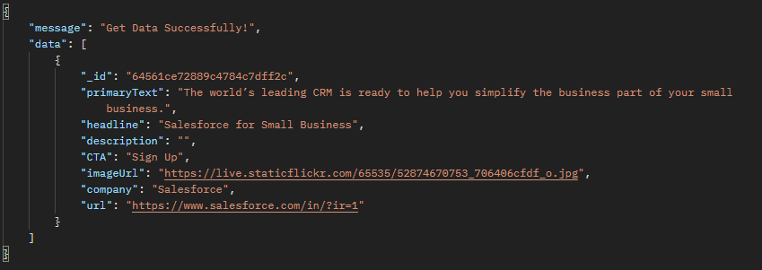

# Ashish_Kohad

## FrontEnd_Deployed_Link: https://ashish-kohad.vercel.app/

## FrontEnd_Github_Link: https://github.com/AshishKohad27/Ashish_Kohad

## BackEnd_Deployed_Link: https://good-cod-wig.cyclic.app/ads?query=

## BackendEnd_Github_Link: https://github.com/AshishKohad27/Ashish_Kohad_B

## Home Page


- Payload or search on input:- sales, worlds, levis

- That payload pass to url

```javascript
https://good-cod-wig.cyclic.app/ads?query=sales, worlds,levis
```

- Then in backend it will take like this

```javascript
const { query } = req.query;
```

- It will pass in aggratation query, since we need data filter base on primary text, heading, company,description we map or our keywords and use or operator and saying that if this keyword take it if not leave it

```javascript
const { query } = req.query;
console.log("query:", query);
let keywords = query.split(",");
console.log("keywords:", keywords);

let search = {
  $or: keywords.map((item) => ({
    $or: [
      //$option: "i" --> "i" flag is used to specify a case-insensitive search.
      //new RegExp --> operator is used to search for documents that match a specified string like includes.
      { primaryText: new RegExp(item, "i") },
      { headline: new RegExp(item, "i") },
      { company: new RegExp(item, "i") },
      { description: new RegExp(item, "i") },
    ],
  })),
};
```

```javascript
// console of serach
```


- Then we get filter data
